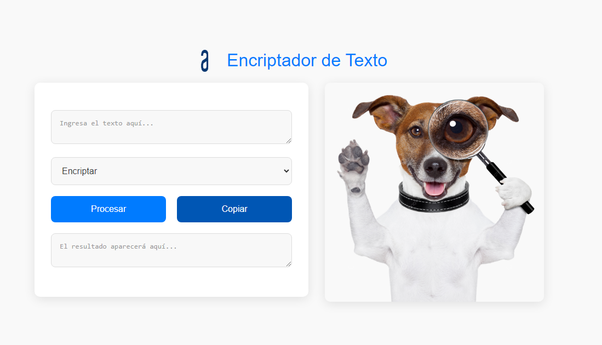
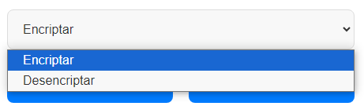
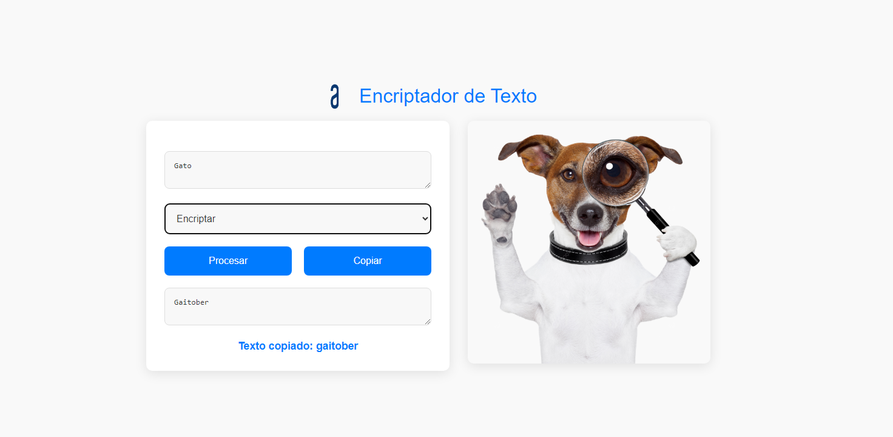

# Alura-Challenge1

# Encriptador/Desencriptador

Bienvenido al proyecto de **Encriptador/Desencriptador**. Esta herramienta web permite a los usuarios encriptar y desencriptar texto de manera sencilla. A continuación, se detalla la funcionalidad y el uso de la aplicación.

## Funcionalidades

1. **Entrada de Texto**: 
   - **Placeholder de Entrada**: El usuario puede ingresar la palabra o frase que desea encriptar o desencriptar en un campo de texto específico.

2. **Salida de Texto**:
   - **Placeholder de Salida**: El resultado del proceso de encriptación o desencriptación se mostrará en otro campo de texto.

3. **Acción Seleccionable**:
   - **Selector de Acción**: Permite al usuario elegir entre dos opciones:
     - **Encriptar**: Para convertir el texto ingresado en un formato encriptado.
     - **Desencriptar**: Para convertir el texto encriptado de vuelta a su formato original.
    

4. **Botones de Acción**:
   - **Procesar**: Ejecuta la acción seleccionada (encriptar o desencriptar) en el texto ingresado y muestra el resultado en el placeholder de salida.
   - **Copiar**: Copia el texto mostrado en el placeholder de salida al portapapeles.

## Ejemplo de Uso

1. **Texto de Entrada**: "Gato"
2. **Acción Seleccionada**: Encriptar
3. **Resultado**: Gatoiber
4. **Copiar Resultado**: Haz clic en "Copiar" para copiar el texto encriptado al portapapeles.

